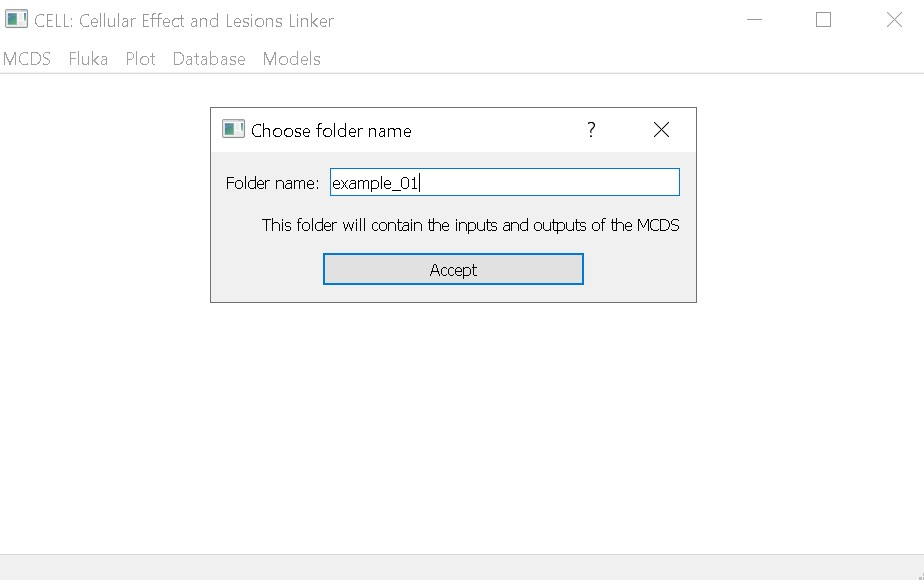
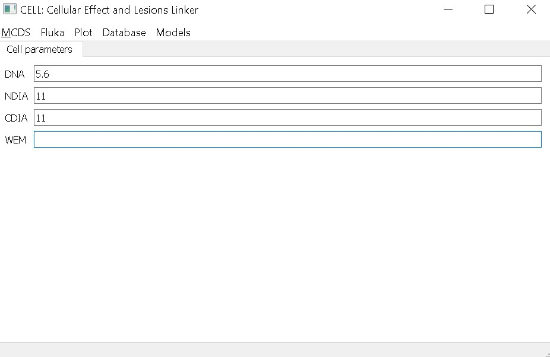
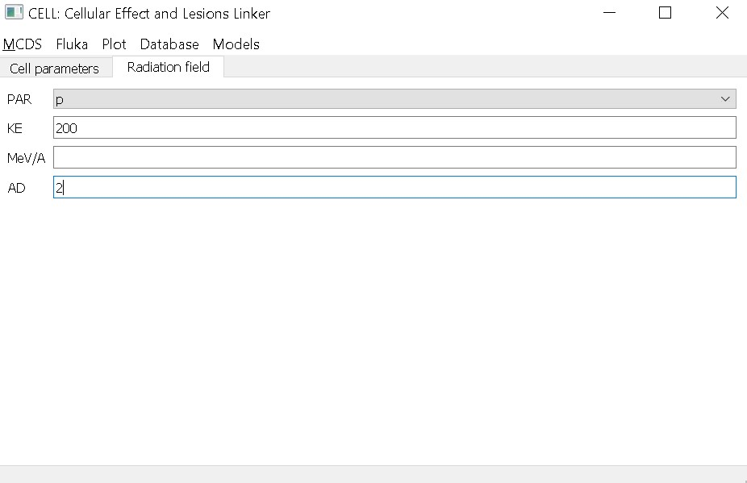
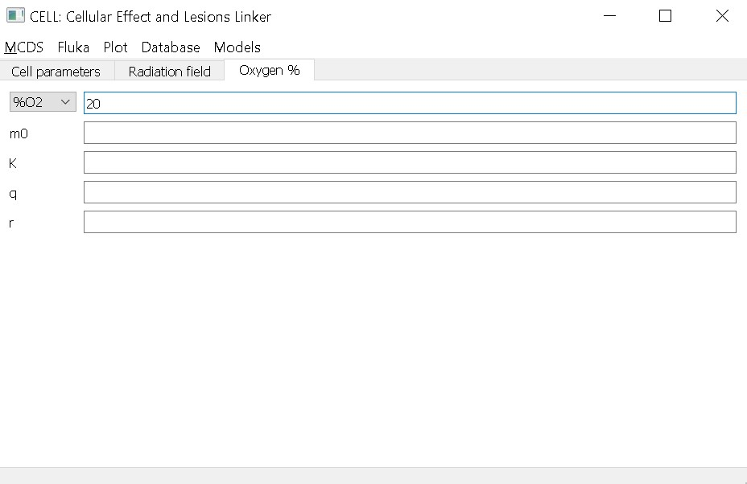
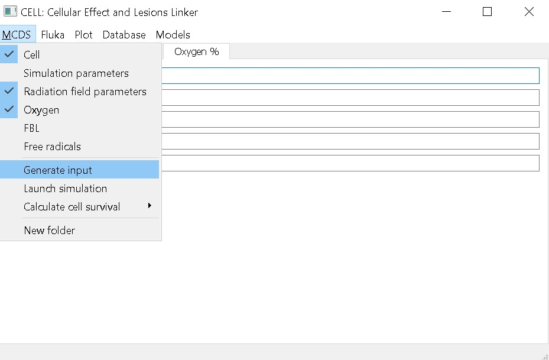
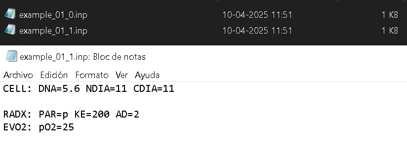
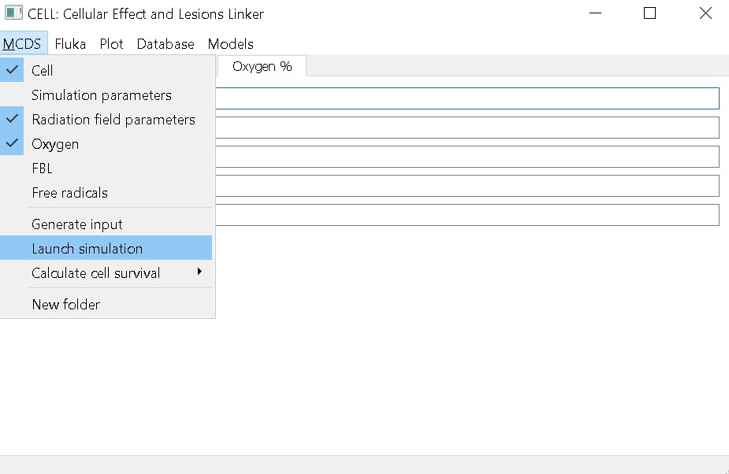
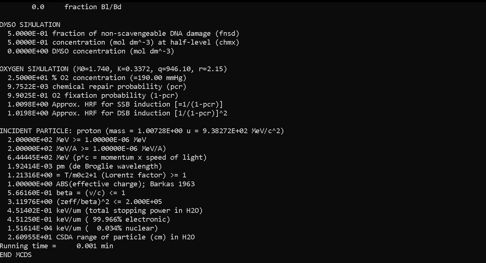

# Run a simple MCDS simulation for a given cell line.
In this tutorial, we’ll show you how to run an MCDS simulation using the following setup:

- Irradiation of V79 cells with monoenergetic protons at 200 MeV in an environment with 20% oxygen concentration, and a dose of 2 Gy.

First, you need to define the name of the folder where the results will be saved. In this example, we’ll use the name `example_01`.

Next, from the top menu, select `MCDS` to set the input parameters. We’ll start by entering the cell parameters through the option `Cell`. We need to define the cell characteristics (such as cell diameter, DNA content, etc.). We’ll use the following values:

| Parameter | V79 |
|--|--|
| NDIA (Nucleus Diameter) | 11 $$\mu$$m |
| CDIA (Cell Diameter) | 11 $$\mu$$m |
| DNA | 5.6 Gbp |

Note that, in this case, we’ve assumed the cells have the same nuclear and cell diameter, but this can be adjusted by the user. We can also leave out some values, such as the WEM (water equivalent material thickness). In that case, the program will use the default value from MCDS.

Now we add want to specify the irradiation conditions, to do this we use the `Radiation field parameters` from the `MCDS` menú. Here we can select the type of particle (protons in this case), the kinetic energy (MeV) and the absorbed dose (AD).

Finally, set the oxygenation conditions by selecting Oxygen from the MCDS menu. Here, you can enter either an oxygen percentage or a pressure value in mmHg.

Once you’ve entered all the desired parameters, the next step is to generate the input file, which will be saved in the folder you specified earlier (example_01). The file will have the name of the folder and an id, in this case the file its `example_01_0.inp`.

You can create as many input files as you like before running the simulations. For instance, you could change the oxygen percentage to 25% and generate a new input file. This new file now has a different id (`example_01_1.inp`).

After you’ve created all the necessary files, start the simulation by clicking on `Launch simulation`. A window will pop up where you’ll need to select the folder containing your input files (`example_01`). 

Once all simulations are complete, the console will display the message End MCDS.

[back](./examples.md)