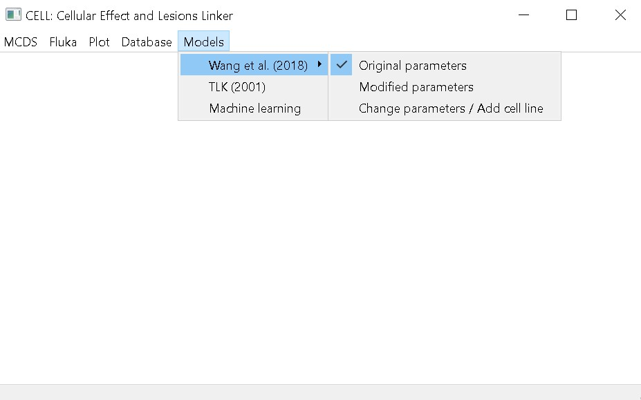
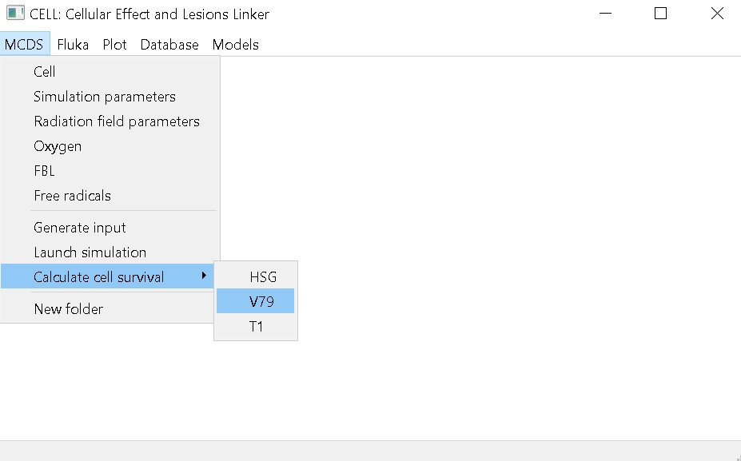
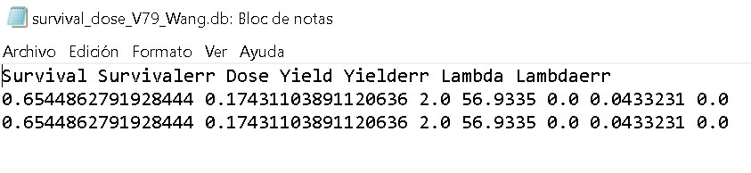

# Calculate the cell survival fraction using Wang's model

This tutorial is a continuation of [Run a simple MCDS simulation for a given cell line](./example_01.md). In the previous step, we ran MCDS simulations using input parameters for a V79 cell. First, make sure the right model is selected. In this case, we will use Wang's model with its original parameters.

Next, go to the `MCDS` menu and select `Calculate cell survival`, then choose the corresponding cell line (in this case, V79). Select the folder containing the MCDS simulation results---following the previous example, this would be `example_01`.

After completing this step, a file named `survival_dose_V79_Wang.db` will be generated. This file contains:
- Calculated cell survival (Survival) and its associated error (Survivalerr)
- Dose
- Number of DSBs per cell per Gy (Yield) and its error (Yielderr)
- Number of DSBs per cell per track (lambda) and its error (lambdaerr)

*Note: The Yield reported by MCDS corresponds to DSBs per cell. To use this value with this model, it is divided by the dose. The resulting value is the one reported in the table above.*

[back](./examples.md)