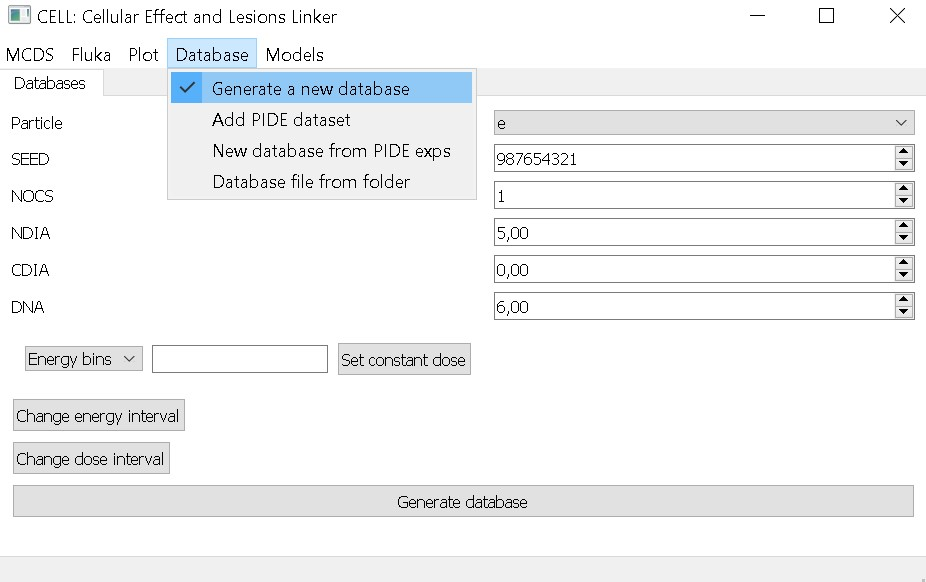
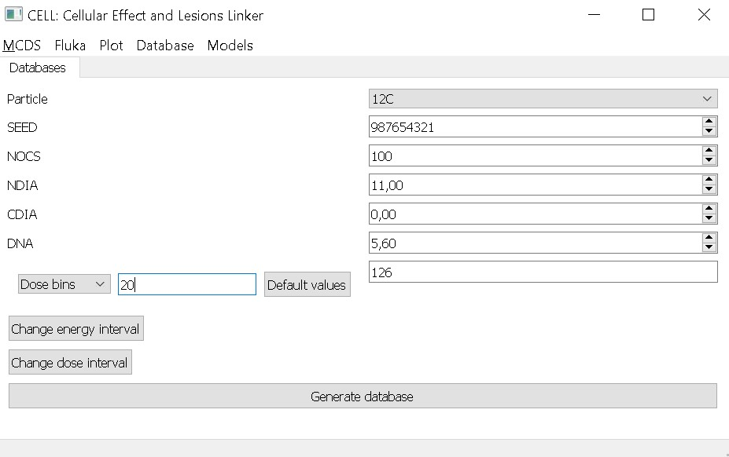
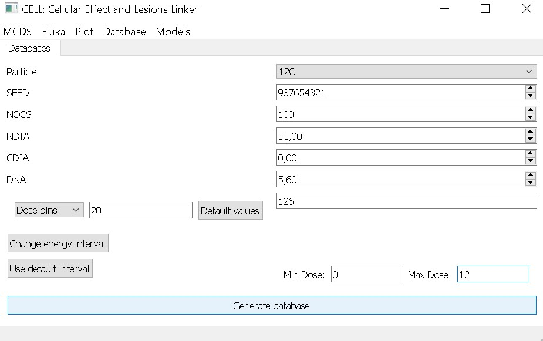
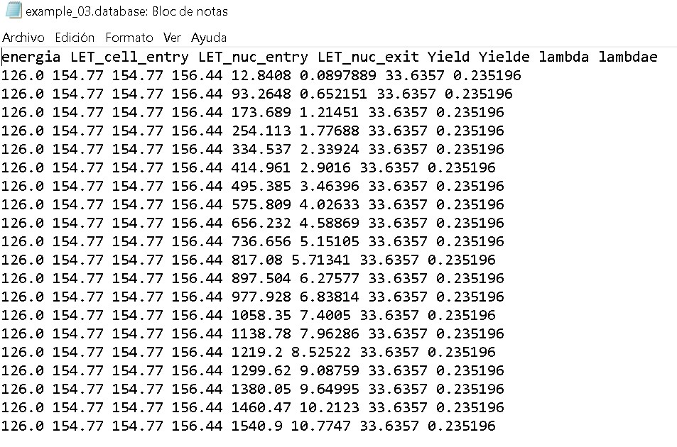

# Generate a database with different doses

First, define the name of the folder where the database will be saved. For this example, we’ll use `example_03`. Then, go to the Database menu and select the option `Generate a new database`.

We’ll use the following parameters for this example:

- Particle: 12C
- NOCS: 100
- NDIA: 11 $$\mu$$m
- CDIA: 0 (we’ll assume it is equal to NDIA)
- DNA: 5.6 Gbp
- Energy: 126 MeV
- 20 different doses ranging from 0.1 to 12 Gy

To set the number of doses (bins), click the `Energy bins` dropdown and select `Dose bins`. A button will appear to change the default energy value (0.5 MeV). Enter the desired energy value, in this case, 126 MeV.

By default, the dose range is from 0.1 Gy to 10 Gy. To modify it, click on `Change dose interval`, then enter the desired values (e.g., 0.1 Gy minimum and 12 Gy maximum). Finally, click on Generate database.
*Note: We use 0.1 Gy as the minimum dose because MCDS automatically replaces an input of 0 Gy with 1 Gy.*

Inside the selected folder (`example_03`, or default if none was specified), you will find the MCDS input and output files, along with the generated database (`.db`). This database contains:

- Energy (*energia*)
- LET at different depths
- Yield (DSBs per cell) and its error (Yielde)
- Lambda (DSBs per cell per track) and its error (lambdae)

[back](./examples.md)