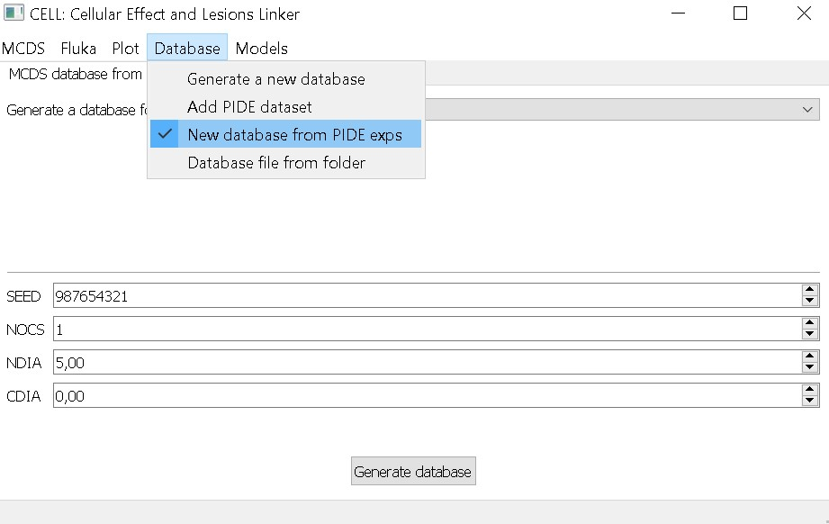
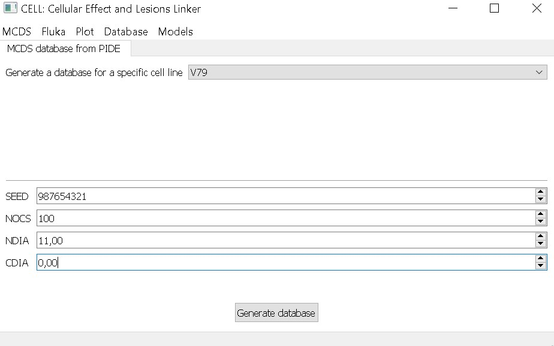

# Generate a database for a cell line using PIDE

In this example, we’ll generate a database using PIDE (Particle Irradiation Data Ensemble [1](./interfaz_grafica_adn.md/#references)). This option compiles the energies and doses used in experiments reported in PIDE for a specific cell line. MCDS simulations are then run using these parameters, and the corresponding yield values (DSBs per cell) are collected for each experiment.

First, select `New database from PIDE exps` from the top menu.

We’ll generate the database for all experiments involving the V79 cell line. You can choose a different cell line using the dropdown menu. For V79, we use the following parameters:

- NOCS: 100
- NDIA: 5.6 µm
- CDIA: 0 (assumed equal to NDIA)

Click on `Generate database`. The MCDS input and output files will be saved in the `PIDE_database_outputs` folder. This step may take some time depending on how many experiments are available for the selected cell line.

[back](./examples.md)