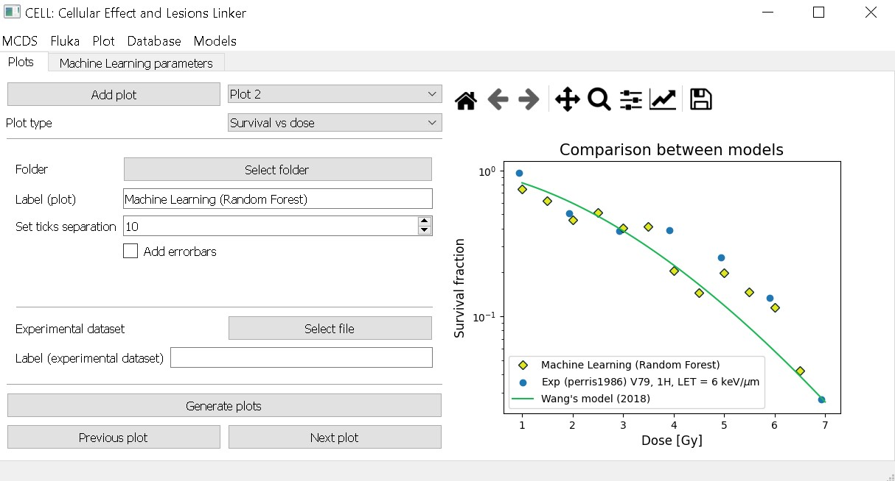

# Usage

After executing `main.py` the program shows a window where the user can specify the name of the folder for the inputs and outputs of the MCDS simulations. It can be ignored, in which case a default name will be used.

CELL has different menus for each funcionality. Each of them is explained below

## Contents

- [MCDS](#mcds)

- [FLUKA](#fluka)

- [Plot](#plot)

- [Database](#database)

- [Models](#models)

## MCDS

This menu serves as a UI for MCDS. The user can modify different parameters or leave the default values. The categories follow the same format of MCDS, i.e. CELL, SIMCOM (simulation parameters), RADX (radiation field parameters), EVO2 (Oxygen parameters), MCDS (FBL) and DMSO (Free radicals). 

After setting the values for the simulation, the user has to generate an input (using the button from the menu) and then launch a simulation by choosing the folder that has the inputs. Here, the user can also create a new folder for the inputs and outputs if the first windows was ignored.

This menu also has an option to calculate the cell survival for two cell lines: V79 and HSG. The model used for this has to be checked in the menu [Models](#models). In this version of the program only two models can be used through this button (Wang and TLK).

## FLUKA

This menu serves as a bridge between Monte Carlo (MC) simulations of particle transport, the software MCDS and a mechanistic model for cell survival. The MC code used by our group is FLUKA, hence the name of the menu.

The user can add different parameters for the simulation chain. The basic ones are related to the MC simulation, i.e Dose data and Spectrum data, which should follow the format of a FLUKA output (see more in [Examples](./examples.md)).

A database can be specified, but a default one is also included. After this, the depth (minimum and maximum) has to be entered by the user and it should match the depths in the MC files. The point separation is a reference to the binning used for the MC simulation. 

The rest of the parameters are needed to calculate cell survival. The cell line (V79 or HSG), its DNA content and Nucleus Diameter (NDIA) and finally the maximum dose to present the data normalized.

To run the simulation chain the button `Fluka -> Survival` has to be clicked. A default folder will be used for the outputs, but a different one can be specified in this same menu.

## Plot

Texto

## Database

Texto

## Models

In this menu the user can choose between 3 models to estimate cell survival:
- Track-damage repair model (Wang et al. 2018)[[6]](./interfaz_grafica_adn.md#references)
- Two lession kinetic model (TLK) (Stewart 2001)[[7]](./interfaz_grafica_adn.md#references)
- A machine learning model developed by our group.

For the first model (Wang et. al 2018), the user can use the original parameters, a modified version or change them manually. It is also possible to add new cell lines by adding the values for each parameter and these can be used later for the simulation chain (see more in [Examples](./examples.md))

For the TLK model a set of default parameters is used and cannot be modified.

For the machine learning model, each parameter can be changed and a range of doses needs to be given. 

[back](./interfaz_grafica_adn.md)