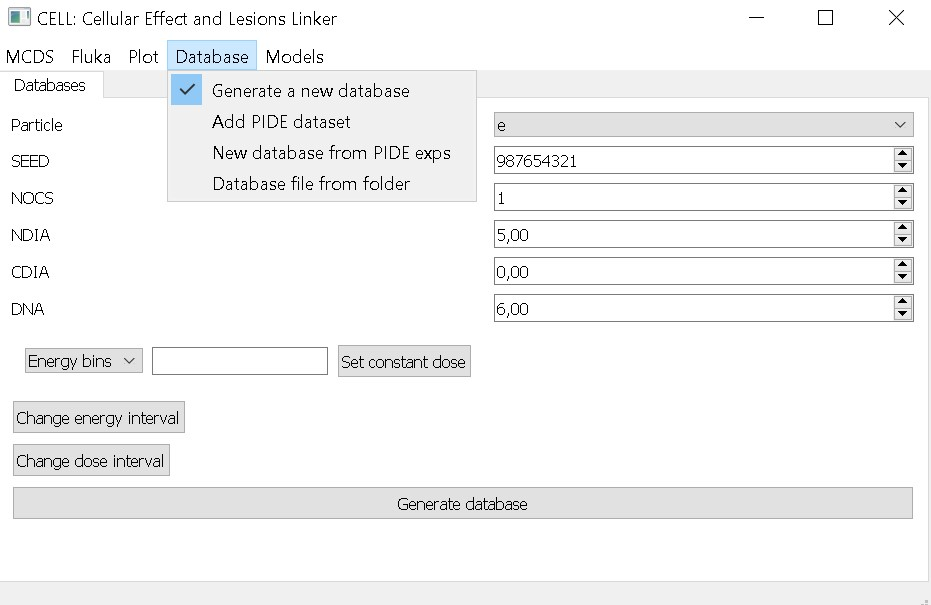

# Usage

After executing `main.py` the program shows a window where the user can specify the name of the folder for the inputs and outputs of the MCDS simulations. It can be ignored, in which case a default name will be used.

CELL has different menus for each funcionality. Each of them is explained below

## Contents

- [MCDS](#mcds)

- [FLUKA](#fluka)

- [Plot](#plot)

- [Database](#database)

- [Models](#models)

## MCDS

This menu serves as a UI for MCDS. The user can modify different parameters or leave the default values. The categories follow the same format of MCDS, i.e. CELL, SIMCOM (simulation parameters), RADX (radiation field parameters), EVO2 (Oxygen parameters), MCDS (FBL) and DMSO (Free radicals). 

After setting the values for the simulation, the user has to generate an input (using the button from the menu) and then launch a simulation by choosing the folder that has the inputs. Here, the user can also create a new folder for the inputs and outputs if the first windows was ignored.

This menu also has an option to calculate the cell survival for different cell lines. The model used for this has to be checked in the menu [Models](#models). 
In this version of the program, only two models can be used through this button: Wang and TLK. The available cell lines depend on the chosen model:

- Wang: V79, HSG, T1, or any new cell line added by the user (see section [Models](#models)).

- TLK: V79, HSG.

## FLUKA

This menu serves as a bridge between Monte Carlo (MC) simulations of particle transport, the software MCDS and a mechanistic model for cell survival. The MC code used by our group is FLUKA, hence the name of the menu.

The user can add different parameters for the simulation chain. The basic ones are related to the MC simulation, i.e Dose data and Spectrum data, which should follow the format of a FLUKA output (see more in [Examples](./examples.md)).

A database can be specified, but a default one is also included. After this, the depth (minimum and maximum) has to be entered by the user and it should match the depths in the MC files. The point separation is a reference to the binning used for the MC simulation. 

The rest of the parameters are needed to calculate cell survival. The cell line (V79 or HSG), its DNA content and Nucleus Diameter (NDIA) and finally the maximum dose to present the data normalized.

To run the simulation chain the button `Fluka -> Survival` has to be clicked. A default folder will be used for the outputs, but a different one can be specified in this same menu.

## Plot

This menu allows the user to easily visualize simulation results and compare different models.

To use it, the minimum requirement is a folder with at least one file with cell survival results (`.db`). Users can specify a label for the plot and set tick spacing on the X-axis, the default being 10. If the results file includes error values, these can be added as errorbars by clicking in the `Add errorbar` option. After this, the user can plot the data by clicking on the `Generate plots` button.

Additionally, this menu allows users to add a set of experimental data. This can be done independently (to show only expeirmental points) or in combination with a model's predictions for comparison. In either case, the user has to specify a file with the experimental data, add a label and finally click on the `Generate plots` button.

Users can add multiple plots as needed. To do so, simply click on the `Add plot` button at the top of the menu. Then, by using the drop-down list, they can select different plots to assign each one of them a folder with results, a label, and other settings. This feature is particularly useful for model comparisons. 

Additional features related to plot styling are available through the icon-based options above the plot area. More details can be found in the [Examples](./examples.md) section.

## Database

In this menu, the user can generate a database. This file compiles simulation results from MCDS based on certain input parameters provided by the user, such as an energy range or dose. The database, with the `.db` extension, consists of:

 - `energy` of the particles, given by the user's input. This value can be fixed or within a range (see more in [Examples](./examples.md)).
 - `LET_cell_entry`, `LET_nuc_entry`, `LET_nuc_exit`: The LET at different positions in the cell, values obtained from MCDS.
 - `Yield` : Number of DBS clusters per cell, from Table 2 of MCDS.
 - `Yielde`: Standard deviation of the yield, from Table 2 of MCDS.
 - `lambda`: Number of DSB clusters per cell per track, from Table 3 of MCDS.
 - `lambdae`: Standard deviation of lambda, from Table 3 of MCDS.

The user can change the default particle, the seed, NOCS (number of simulations), and cell parameters (NDIA, CDIA and DNA).
After this, a number of bins must be selected to divide the energy or dose range. This number corresponds to the total number of rows in the database.
There are default values for energy and dose, both for fixed values and ranges, as follows:
-   The default energy range is [0.5 - 500 MeV], divided into as many bins as the user chooses.
-   The default dose range is [0.1 - 10 Gy].
-   The default fixed energy is 0.5 MeV.
-   The default fixed dose is 0.1 Gy.

It is recommended to check the [Examples](./examples.md) section for more details on these options.

## Models

In this menu the user can choose between 3 models to estimate cell survival:
- Track-damage repair model (Wang et al. 2018)[[6]](./interfaz_grafica_adn.md#references)
- Two lession kinetic model (TLK) (Stewart 2001)[[7]](./interfaz_grafica_adn.md#references)
- A machine learning model developed by our group.

For the first model (Wang et. al 2018), the user can use the original parameters, a modified version or change them manually. It is also possible to add new cell lines by adding the values for each parameter and these can be used later for the simulation chain (see more in [Examples](./examples.md))

For the TLK model a set of default parameters is used and cannot be modified.

For the machine learning model, each parameter can be changed and a range of doses needs to be given. 

For the machine learning model, each parameter can be changed and a dose range must be provided. The figure belown shows the menu for the machine learning model.
The user can manually enter the parameter values or select a PIDE ID to use data from a specific experiment as input. For the latter, the checkbox  `Use PIDE values for a given #ExpID` must be selected.

[back](./interfaz_grafica_adn.md)